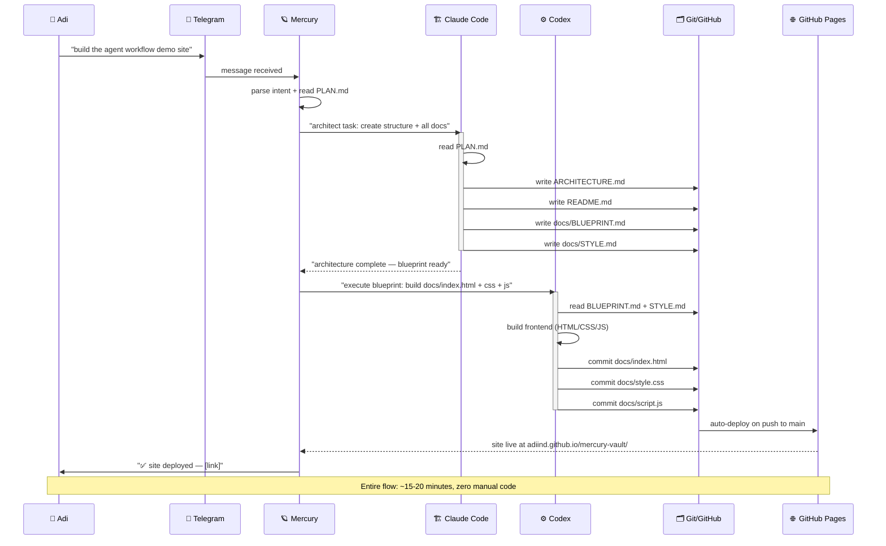
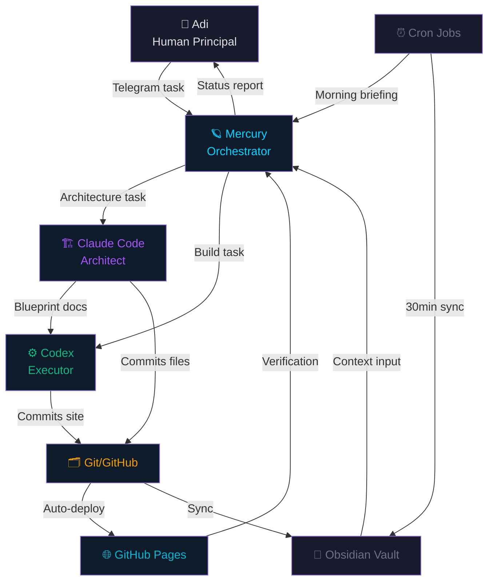

# Agent Orchestration Architecture

> **Meta-note:** This document was produced by the **Claude Code (Architect)** layer in response to a task issued by Adi via Telegram → Mercury → Claude Code. The act of reading this document *is* a demonstration of the pipeline it describes.

---

## Table of Contents

1. [System Overview](#system-overview)
2. [Agent Roles](#agent-roles)
3. [Full Pipeline Diagram](#full-pipeline-diagram)
4. [Execution Model (This Project)](#execution-model-this-project)
5. [Communication Protocols](#communication-protocols)
6. [Automated Background Systems](#automated-background-systems)
7. [Data Flow — Detailed](#data-flow--detailed)
8. [Failure Modes & Resilience](#failure-modes--resilience)
9. [This Document As Evidence](#this-document-as-evidence)

---

## System Overview

Adi's environment is a **self-building, self-documenting AI pipeline** where a human issues high-level intent and a chain of specialized agents decomposes, architects, executes, and commits the work — autonomously. The human's primary touch-points are:

- **Telegram** — task issuance (natural language, conversational)
- **Obsidian** — knowledge base (passively synced; Adi reads/writes manually)
- **GitHub** — final artifact store (everything that ships lives here)

Everything in between is automated.

---

## Agent Roles

### Adi (Human Principal)
- Issues tasks in natural language via Telegram
- Provides context, approvals, and course corrections
- Reviews final outputs (the site, the commits, the docs)
- Does **not** write code, create files, or push commits in the normal workflow

### Mercury (Orchestrator — Hermes/Moonshot Model)
- **Role:** CEO of the agent stack. Receives Adi's raw intent, decomposes it into actionable sub-tasks, and routes work to the correct executor.
- **Model:** Moonshot (high-context reasoning, long-horizon planning)
- **Capabilities:** Task decomposition, agent delegation, context management, QC/verification, GitHub push
- **Inputs:** Telegram messages from Adi
- **Outputs:** Delegated tasks to Claude Code, Codex; final Git push; status reports back to Adi
- **Tone:** Direct, engineering-first. Mercury speaks to agents in precise technical language.

### Claude Code (Architect — this instance)
- **Role:** System architect and documentation layer. Creates the structural scaffolding that Codex builds on.
- **Model:** Claude Sonnet 4.6 (Claude Code)
- **Capabilities:** Markdown/docs authoring, file structure creation, technical specification writing, code review, architecture design
- **Inputs:** Task descriptions from Mercury, PLAN.md, existing repo state
- **Outputs:** ARCHITECTURE.md, README.md, docs/BLUEPRINT.md, docs/STYLE.md — the full specification set
- **Does NOT:** Write production HTML/CSS/JS (that's Codex's domain)

### Codex (Executor — OpenAI)
- **Role:** Frontend execution engine. Takes Claude's architectural blueprint and builds the actual deliverable.
- **Capabilities:** HTML/CSS/JS generation, iterative refinement, responsive implementation, animation code
- **Inputs:** docs/BLUEPRINT.md, docs/STYLE.md, ARCHITECTURE.md
- **Outputs:** docs/index.html, docs/style.css, docs/script.js
- **Constraint:** Codex receives the blueprint as authoritative spec — it executes, does not redesign

### Git / GitHub (Persistence Layer)
- **Role:** Single source of truth. Every artifact produced by every agent lands in Git.
- **Mechanism:** Automated commits with structured messages; GitHub Pages serves the frontend
- **GitHub Pages URL:** `https://adiind.github.io/mercury-vault/`
- **Branch strategy:** `main` — direct commit model (no PR overhead in this autonomous pipeline)

### Cron Jobs (Heartbeat Layer)
- **Morning briefing:** Fires each morning — Mercury synthesizes overnight GitHub activity, news relevant to Adi's projects, and delivers a Telegram digest
- **Obsidian sync:** Every 30 minutes — git pull + push cycle keeps the knowledge vault current across devices
- **Deployment check:** Post-push verification that GitHub Pages is live and responding

### Obsidian Vault (Knowledge Base)
- **Role:** Long-term memory and reference store for Adi's thinking
- **Sync mechanism:** Git hooks + cron (30-min cycle)
- **Integration:** Mercury can read vault notes as context when given a task; new documents created by Claude Code may be added to the vault

---

## Full Pipeline Diagram

### High-Level Flow

```
┌─────────────────────────────────────────────────────────────────────┐
│                        ADI'S PIPELINE                                │
│                                                                       │
│   ADI                                                                 │
│    │                                                                  │
│    │  "build the agent workflow demo site"                           │
│    │  [Telegram message]                                              │
│    ▼                                                                  │
│  ┌─────────────────────────────────────────────────────────────────┐ │
│  │                    MERCURY (Orchestrator)                        │ │
│  │  • Parses intent                                                 │ │
│  │  • Reads existing PLAN.md                                        │ │
│  │  • Decomposes: [architect] → [build] → [deploy]                 │ │
│  │  • Routes: Claude Code gets architecture task                    │ │
│  └──────────────────────┬──────────────────────────────────────────┘ │
│                          │                                            │
│            ┌─────────────┴─────────────┐                             │
│            │                           │                             │
│            ▼                           ▼                             │
│  ┌─────────────────────┐   ┌─────────────────────────┐              │
│  │   CLAUDE CODE        │   │        CODEX             │              │
│  │   (Architect)        │   │      (Executor)          │              │
│  │                      │   │                          │              │
│  │  Creates:            │   │  Reads blueprint →       │              │
│  │  • ARCHITECTURE.md   │   │  Builds:                 │              │
│  │  • README.md         │ ─▶│  • docs/index.html       │              │
│  │  • docs/BLUEPRINT.md │   │  • docs/style.css        │              │
│  │  • docs/STYLE.md     │   │  • docs/script.js        │              │
│  └─────────────────────┘   └──────────┬──────────────┘              │
│                                        │                              │
│                                        ▼                              │
│                            ┌─────────────────────┐                   │
│                            │   GIT / GITHUB       │                   │
│                            │                      │                   │
│                            │  commit + push →     │                   │
│                            │  GitHub Pages live   │                   │
│                            └──────────┬──────────┘                   │
│                                        │                              │
│                                        ▼                              │
│                            ┌─────────────────────┐                   │
│                            │   MERCURY (QC)       │                   │
│                            │                      │                   │
│                            │  Verifies site live  │                   │
│                            │  Reports to Adi      │                   │
│                            └──────────┬──────────┘                   │
│                                        │                              │
│                                        ▼                              │
│                                       ADI                             │
│                            [gets Telegram notification]               │
│                            "site is live: https://..."               │
└─────────────────────────────────────────────────────────────────────┘
```

### Mermaid Sequence Diagram



### Mermaid Graph — Agent Topology



---

## Execution Model (This Project)

This is the specific sequence for creating the agent-workflow-site:

### Phase 1 — Inception
```
Adi → Telegram → Mercury
Task: "build the agent workflow demo site, use PLAN.md"
```

### Phase 2 — Architecture (Claude Code)
Claude Code receives the task, reads `PLAN.md`, and creates the full specification:

| File | Purpose | Consumer |
|------|---------|---------|
| `ARCHITECTURE.md` | This file — system design, diagrams | Mercury, future agents, humans |
| `README.md` | Project overview and deploy instructions | GitHub visitors, Mercury |
| `docs/BLUEPRINT.md` | Exact frontend specification | Codex |
| `docs/STYLE.md` | Design system, tokens, states | Codex |

**Claude Code does NOT write HTML/CSS/JS.** The boundary is clear: architecture produces specs; execution produces artifacts.

### Phase 3 — Execution (Codex)
Codex reads `docs/BLUEPRINT.md` and `docs/STYLE.md` as authoritative specs and produces:

| File | Description |
|------|-------------|
| `docs/index.html` | Single-page app, semantic HTML |
| `docs/style.css` | All styles, CSS custom properties |
| `docs/script.js` | Animations, GitHub API, interactivity |

### Phase 4 — Deployment (Mercury + GitHub)
Mercury runs the git push; GitHub Pages auto-deploys from the `docs/` folder; Mercury verifies the site is live and notifies Adi.

---

## Communication Protocols

### Mercury ↔ Agents
- **Format:** Structured task objects with `task_id`, `priority`, `context`, `deliverables`
- **Channel:** Direct API calls or context injection
- **Response contract:** Each agent must report `completed`, `output_paths`, and any `blockers`

### Mercury ↔ Adi
- **Channel:** Telegram Bot API
- **Format:** Conversational natural language + structured status lines
- **Status format:** `✅ [task] complete — [artifact/link]`

### Git as Message Bus
Git commits serve as handoff signals between agents:
- Claude Code's final commit with `BLUEPRINT.md` → signals Codex to start
- Codex's commit with `docs/index.html` → signals Mercury to verify
- Commit message format: `[agent]: [action] — [artifact]`

---

## Automated Background Systems

### Morning Briefing Cron
```
Schedule: daily at configured time (Adi's local timezone)
Trigger: cron → Mercury
Action:
  1. Query GitHub API for overnight commits across all repos
  2. Check any open issues/PRs
  3. Pull Obsidian vault latest
  4. Synthesize summary
  5. Send Telegram message to Adi
Format: "☀️ Morning brief — [date]
  • [N] commits across [repos]
  • [highlights]
  • Today's queue: [pending tasks]"
```

### Obsidian Vault Sync
```
Schedule: every 30 minutes
Trigger: cron → shell script
Action:
  1. git pull origin main (vault repo)
  2. git add -A
  3. git commit -m "Mercury session sync — [timestamp]" (if changes)
  4. git push origin main
Effect: Adi's vault stays current on all devices; Mercury always has latest context
```

---

## Data Flow — Detailed

### Task Data Shape (Mercury → Claude Code)
```json
{
  "task_id": "agent-workflow-site-arch-001",
  "type": "architecture",
  "priority": "high",
  "context": {
    "plan_file": "PLAN.md",
    "repo": "adiind/mercury-vault",
    "target_path": "projects/agent-workflow-site/"
  },
  "deliverables": [
    "ARCHITECTURE.md",
    "README.md",
    "docs/BLUEPRINT.md",
    "docs/STYLE.md"
  ],
  "constraints": [
    "Do not write HTML/CSS/JS",
    "Blueprint must be detailed enough for Codex to execute without clarification",
    "Include Mermaid diagrams"
  ]
}
```

### GitHub API Data (Live Feed on Site)
The site pulls from:
```
GET https://api.github.com/repos/adiind/mercury-vault/commits
  ?per_page=10
  &sha=main
```

Response fields used:
- `commit.message` — display text
- `commit.author.date` — timestamp  
- `commit.author.name` — agent/author identifier
- `sha` — short hash for display
- `html_url` — link to commit on GitHub

---

## Failure Modes & Resilience

| Scenario | Detection | Recovery |
|----------|-----------|---------|
| Codex produces broken HTML | Mercury validates with headless browser | Mercury re-prompts Codex with specific error |
| GitHub API rate limit hit | 403 response check | Graceful degradation: show cached/placeholder feed |
| Pages deployment slow | HTTP check with retry | Mercury waits 2min, re-checks, then notifies Adi |
| Blueprint ambiguity | Codex flags unclear spec | Mercury escalates back to Claude Code for clarification |
| Obsidian sync conflict | git merge conflict | Mercury resolves via `ours` strategy + notifies Adi |

---

## This Document As Evidence

This file (`ARCHITECTURE.md`) was not written by Adi. It was:

1. **Requested** by Adi via Telegram ("build the agent workflow demo site")
2. **Decomposed** by Mercury into: architect task → this document (among others)
3. **Written** by Claude Code (this instance, claude-sonnet-4-6) per the task spec
4. **Committed** to Git as part of the architecture phase
5. **Will be read** by Codex as context when building the frontend
6. **Will be displayed** on the site as documentation of the pipeline

The document *about* the pipeline was *produced by* the pipeline. That recursion is the point.

---

*Architecture authored by Claude Code (claude-sonnet-4-6) · Orchestrated by Mercury · Commissioned by Adi*  
*Part of the mercury-vault autonomous development stack*
